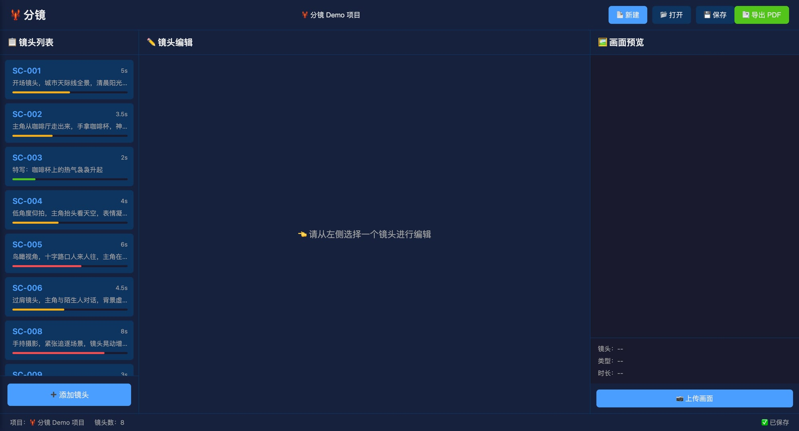
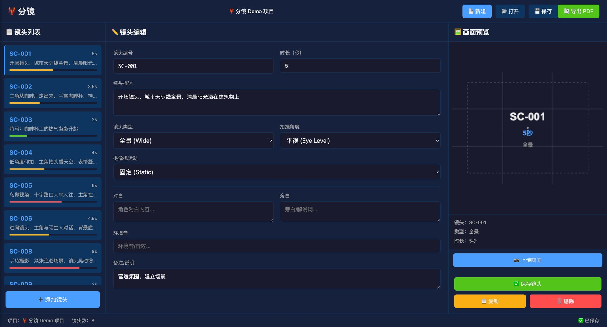
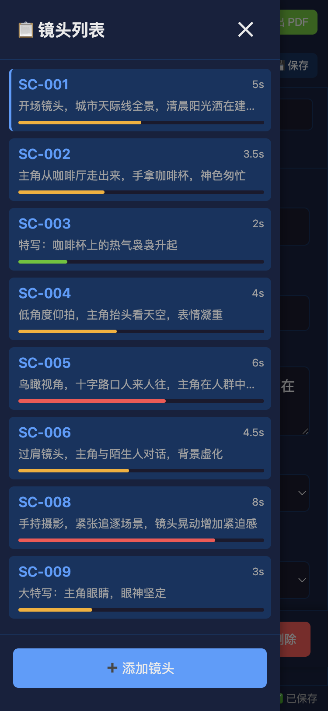
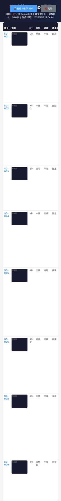

# 🦞 龙虾分镜 - Storyboard Pro

专业的分镜制作工具，为视频创作者和影视工作者设计。

## 🎯 功能特性

### 核心功能
- ✅ **镜头管理** - 添加、删除、调整镜头顺序
- ✅ **内容编辑** - 描述、时长、镜头类型、拍摄角度、摄像机运动
- ✅ **可视化预览** - 实时预览镜头效果
- ✅ **项目保存** - JSON 格式保存/加载完整项目
- ✅ **导出功能** - 导出分镜脚本和图片

### 镜头类型支持
- 🎑 全景 (Wide)
- 👤 中景 (Medium)
- 😊 特写 (Close-up)
- 👁️ 大特写 (Extreme Close-up)
- 💬 过肩镜头 (Over Shoulder)
- 🎯 主观视角 (POV)

### 拍摄角度
- 平视、俯视、仰视、鸟瞰、虫视

### 摄像机运动
- 固定、摇镜、俯仰、推拉、跟踪、移动、手持

## 🚀 快速开始

### 方式一：浏览器运行（无需安装）

```bash
# 直接用浏览器打开
open src/index.html
```

### 方式二：Electron 桌面应用

```bash
# 安装依赖
npm install

# 启动应用
npm start

# 打包应用
npm run build
```

## 📁 项目结构

```
storyboard-pro/
├── src/
│   ├── index.html      # 主界面
│   ├── style.css       # 样式表
│   ├── app.js          # 应用逻辑
│   ├── main.js         # Electron 主进程
│   └── preload.js      # 预加载脚本
├── package.json
└── README.md
```

## 💾 数据格式

项目保存为 JSON 格式：

```json
{
  "name": "项目名称",
  "created": "2026-03-07T10:00:00.000Z",
  "modified": "2026-03-07T10:00:00.000Z",
  "shots": [
    {
      "id": "shot_xxx",
      "number": "SC-001",
      "description": "镜头描述",
      "duration": 3.0,
      "type": "wide",
      "angle": "eye",
      "camera": "static",
      "notes": "备注"
    }
  ]
}
```

## 🎨 界面说明

### 主界面


### 镜头编辑


### 移动端适配


### 导出功能


### 三栏布局
- **左侧** - 镜头列表（支持拖拽排序）
- **中间** - 镜头编辑器
- **右侧** - 实时预览

### 工具栏
- 新建/打开/保存项目
- 导出 PDF/图片

### 状态栏
- 显示项目名称、镜头数、保存状态

## 🛠️ 技术栈

- **前端** - HTML5 + CSS3 + Vanilla JavaScript
- **桌面应用** - Electron
- **构建工具** - Vite (可选)
- **导出** - Canvas API + 原生下载

## 📝 使用技巧

1. **快速添加镜头** - 点击左侧「添加镜头」按钮
2. **调整顺序** - 拖拽镜头列表中的项目
3. **编辑内容** - 点击镜头后在中间面板编辑
4. **保存项目** - 定期保存避免数据丢失
5. **导出脚本** - 完成后可导出文本脚本供团队使用

## 🔄 开发计划

### v1.0 (当前版本)
- ✅ 基础镜头管理
- ✅ 内容编辑
- ✅ 预览功能
- ✅ 保存/加载
- ✅ 导出功能

### v1.1 (计划中)
- ⏳ 镜头缩略图/草图
- ⏳ 批量操作
- ⏳ 模板系统
- ⏳ 分镜头格子绘制

### v2.0 (未来)
- ⏳ 协作功能
- ⏳ 云同步
- ⏳ 视频参考导入

## 📄 许可证

MIT License

## 👨‍💻 开发信息

- **项目** - 龙虾分镜
- **版本** - 1.0.0
- **开发** - 开发助理 👨‍💻
- **测试** - 虾哥 🦐
- **创建日期** - 2026-03-07
